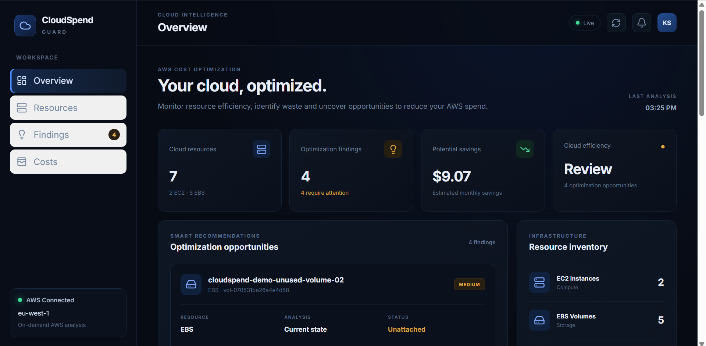
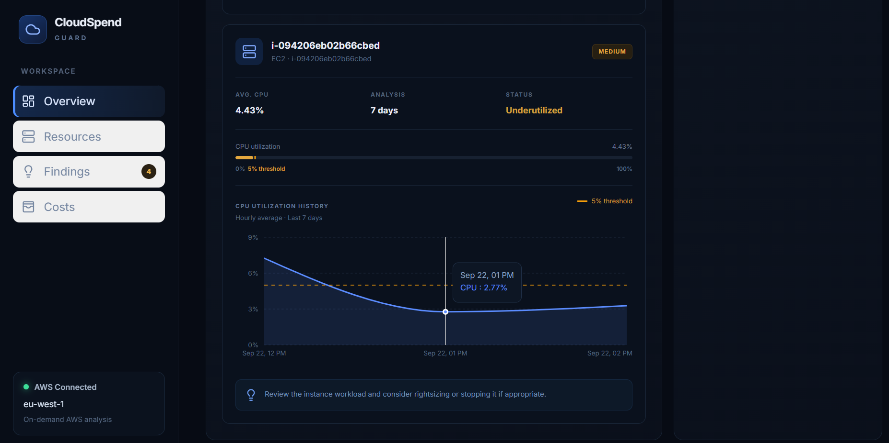
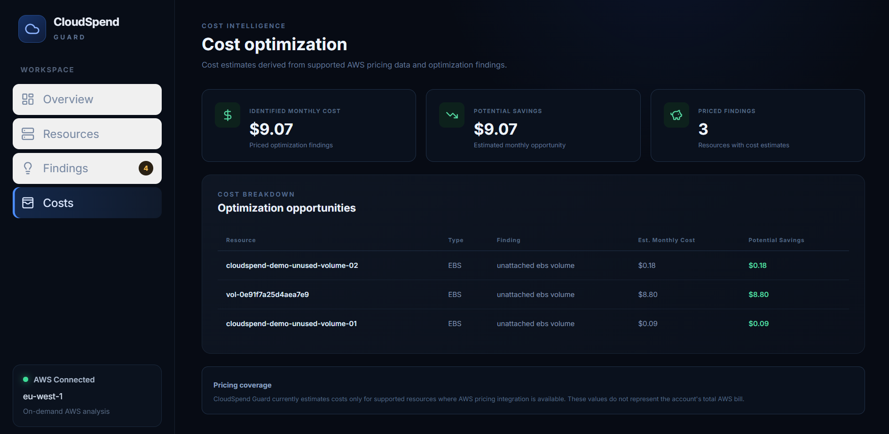
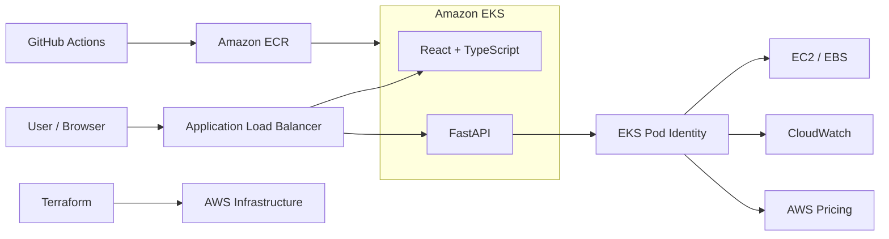

# ☁️ CloudSpend Guard

> **AWS cloud cost optimization platform that discovers resources, analyzes utilization and pricing data, and generates actionable cost-saving recommendations.**

CloudSpend Guard is a full-stack cloud engineering and DevOps project built to demonstrate a production-style AWS platform using **Amazon EKS, Terraform, Kubernetes, Helm, Docker, GitHub Actions, AWS ECR, EKS Pod Identity, CloudWatch, and FastAPI**.

The application was deployed and validated against real AWS resources. After validation and portfolio capture, the live infrastructure was intentionally decommissioned to avoid unnecessary cloud costs.

---

## ✨ What It Does

CloudSpend Guard analyzes AWS infrastructure and identifies potential cost optimization opportunities.

Current capabilities include:

- 🔎 Discover EC2 instances and EBS volumes
- 📊 Analyze EC2 CPU utilization through Amazon CloudWatch
- 💾 Detect unattached EBS volumes
- ⚡ Identify low-utilization EC2 instances
- 💰 Estimate resource costs and potential monthly savings
- 📈 Display resource and optimization metrics through a React dashboard
- 🔄 Refresh analysis against AWS resources
- 🔐 Access AWS APIs securely from EKS using Pod Identity
- 🛡️ Operate in recommendation-only mode without automatically deleting resources

---

## 📸 Dashboard

### Cloud Overview

Real AWS resource inventory, optimization findings, and estimated savings.



### EC2 Utilization Analysis

CloudSpend Guard analyzes CloudWatch CPU metrics over a configurable analysis period and generates optimization recommendations for underutilized instances.



### Cost Optimization

Cost findings are consolidated into a dedicated view showing identified monthly cost and estimated optimization opportunities.



> **Deployment status:** The AWS environment shown above was successfully deployed and validated on Amazon EKS. It was intentionally decommissioned after testing to minimize ongoing AWS costs.

---

## 🏗️ Architecture



### Request Flow

```text
Internet
   │
   ▼
AWS Application Load Balancer
   │
   ├── /        ─────► React Frontend
   │
   └── /api/v1  ─────► FastAPI Backend
                            │
                            ▼
                     EKS Pod Identity
                            │
              ┌─────────────┼─────────────┐
              ▼             ▼             ▼
           EC2/EBS      CloudWatch     AWS Pricing
```

A more detailed architecture description is available in [`docs/architecture.md`](docs/architecture.md).

---

## 🛠️ Technology Stack

| Area | Technologies |
|---|---|
| **Frontend** | React, TypeScript, Vite |
| **Backend** | Python, FastAPI |
| **Cloud** | AWS |
| **Containers** | Docker |
| **Orchestration** | Kubernetes, Amazon EKS |
| **Infrastructure as Code** | Terraform |
| **Deployment** | Helm |
| **CI/CD** | GitHub Actions |
| **Container Registry** | Amazon ECR |
| **Authentication** | IAM, GitHub OIDC, EKS Pod Identity |
| **Monitoring Data** | Amazon CloudWatch |
| **Cost Analysis** | AWS Pricing APIs |
| **Ingress** | AWS Application Load Balancer |

---

## ☁️ AWS Infrastructure

The AWS environment is defined with Terraform under:

```text
infrastructure/terraform/
```

The infrastructure includes:

- Custom VPC
- Public and private subnets across multiple Availability Zones
- Internet Gateway
- NAT Gateway
- Amazon EKS cluster
- Managed EKS worker node group
- EKS managed addons
- Amazon ECR repositories
- IAM roles and policies
- EKS Pod Identity associations
- AWS Load Balancer Controller
- GitHub Actions OIDC integration
- Remote Terraform state stored in Amazon S3

Application workloads run on worker nodes in **private subnets**, while internet traffic enters through an AWS Application Load Balancer.

---

## 🔐 AWS Authentication

CloudSpend Guard avoids embedding AWS credentials inside application containers.

The backend uses **EKS Pod Identity**:

```text
FastAPI Pod
    │
    ▼
Kubernetes Service Account
    │
    ▼
EKS Pod Identity Association
    │
    ▼
IAM Role
    │
    ▼
AWS APIs
```

Separate IAM roles are used for application access, the AWS Load Balancer Controller, VPC CNI, EKS nodes, and CI/CD.

GitHub Actions authenticates to AWS using **OIDC federation**, avoiding long-lived AWS access keys in GitHub.

---

## 🔄 CI/CD Pipeline

The CI/CD workflow is defined in:

```text
.github/workflows/ci.yml
```

The pipeline validates the application and builds container images for the frontend and backend.

Production images are pushed to Amazon ECR using the Git commit SHA as an immutable image tag.

```text
Git Push
   │
   ▼
GitHub Actions
   │
   ├── Backend validation/tests
   ├── Frontend validation/build
   │
   ▼
Docker Build
   │
   ▼
GitHub OIDC → AWS
   │
   ▼
Amazon ECR
   │
   ▼
Immutable SHA-tagged Images
   │
   ▼
Helm / Amazon EKS
```

Using commit-specific image tags makes each deployed application version traceable to source control.

---

## ☸️ Kubernetes & Helm

Kubernetes manifests are packaged using Helm:

```text
helm/cloudspend-guard/
```

The chart manages:

- Backend Deployment
- Frontend Deployment
- Backend Service
- Frontend Service
- Backend ServiceAccount
- Kubernetes namespace
- ALB Ingress configuration

The frontend and backend run as separate Kubernetes workloads.

The production deployment used multiple replicas for both services and Kubernetes health probes for workload monitoring.

---

## 🌐 Application Load Balancing

The application uses the **AWS Load Balancer Controller**.

Traffic is routed through a shared Application Load Balancer:

```text
/          → Frontend Service
/api/v1    → Backend Service
```

Separate health checks are configured for the frontend and backend.

This allows the React application and FastAPI API to be exposed through a single AWS entry point.

---

## 💰 Cost Optimization Engine

The backend separates AWS discovery, metrics collection, pricing, and recommendation logic into dedicated services.

```text
backend/app/services/
├── aws/
│   ├── cloudwatch.py
│   ├── ebs.py
│   ├── ec2.py
│   └── pricing.py
├── cloud_analysis.py
├── pricing.py
└── recommendations.py
```

### Example Analysis

For EC2 instances, CloudSpend Guard can:

1. Discover running instances
2. Retrieve CloudWatch CPU utilization
3. Analyze utilization over the configured period
4. Detect low-utilization resources
5. Generate a recommendation
6. Present the result through the API and dashboard

For EBS volumes, the platform can detect unattached storage and estimate its monthly cost and potential savings.

### Safety by Design

CloudSpend Guard currently operates in **recommendation-only mode**.

It does **not** automatically:

- Stop EC2 instances
- Terminate EC2 instances
- Delete EBS volumes
- Modify production resources

This keeps optimization decisions under human control.

---

## 🔌 API

The FastAPI backend exposes endpoints under `/api/v1`.

Key endpoints include:

```text
GET /api/v1/health
GET /api/v1/resources/ec2
GET /api/v1/resources/ebs
GET /api/v1/recommendations
GET /api/v1/dashboard
```

The dashboard endpoint aggregates resource discovery, findings, and estimated savings for the frontend.

---

## 🧪 Testing

The backend includes automated tests covering:

- Health API
- Dashboard API
- EC2 discovery
- EBS discovery
- CloudWatch integration logic
- Pricing calculations
- Recommendation generation
- Resource APIs
- EC2 optimization recommendations

Tests are located under:

```text
backend/tests/
```

The frontend also uses linting and production build validation as part of development and CI checks.

---

## 🐳 Local Development

### Prerequisites

- Docker
- Docker Compose
- AWS credentials/profile if using live AWS scanning

Clone the repository:

```bash
git clone https://github.com/keshav2613/cloudspend-guard.git
cd cloudspend-guard
```

Start the application:

```bash
docker compose up --build
```

Docker Compose runs the frontend and backend locally while keeping the services containerized.

---

## 📁 Repository Structure

```text
cloudspend-guard/
├── .github/
│   └── workflows/
│       └── ci.yml
│
├── backend/
│   ├── app/
│   │   ├── api/
│   │   ├── core/
│   │   └── services/
│   ├── tests/
│   └── Dockerfile
│
├── frontend/
│   ├── src/
│   │   ├── components/
│   │   ├── services/
│   │   └── types/
│   └── Dockerfile
│
├── helm/
│   ├── aws-load-balancer-controller/
│   └── cloudspend-guard/
│
├── infrastructure/
│   └── terraform/
│
├── docs/
│   ├── adr/
│   ├── images/
│   └── architecture.md
│
├── compose.yaml
├── LICENSE
└── README.md
```

---

## 🧠 Engineering Decisions

Some of the key engineering decisions made during the project include:

**Private EKS workers**  
Application worker nodes were deployed in private subnets rather than directly exposed to the internet.

**Pod Identity instead of static credentials**  
AWS permissions are provided to Kubernetes workloads through EKS Pod Identity.

**OIDC for CI/CD**  
GitHub Actions uses federated authentication rather than stored AWS access keys.

**Immutable container versions**  
Docker images use Git commit SHA tags instead of relying only on `latest`.

**Infrastructure as Code**  
AWS infrastructure is reproducible through Terraform.

**Helm-based application deployment**  
Kubernetes resources are packaged and configured through Helm.

**Recommendation-only optimization**  
The platform surfaces optimization opportunities without automatically modifying infrastructure.

**Cost-aware infrastructure lifecycle**  
The production-style AWS environment was provisioned for deployment validation and intentionally torn down afterward to prevent unnecessary ongoing costs.

Additional architectural decisions are documented under [`docs/adr/`](docs/adr/).

---

## 🔮 Future Improvements

Potential future development includes:

- Additional AWS resource scanners
- Historical cost trends
- Savings Plans / Reserved Instance analysis
- Configurable optimization policies
- Multi-account AWS support
- Notification integrations
- Persistent recommendation history
- Authentication and role-based access control
- Automated scheduled scans
- Additional observability and application metrics

---

## 📄 License

This project is licensed under the [MIT License](LICENSE).

---

## 👤 Author

**Keshav Singh**

Cloud / DevOps Engineer

[GitHub](https://github.com/keshav2613)